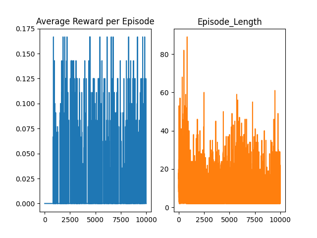
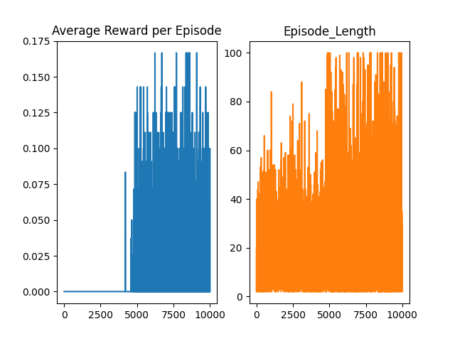
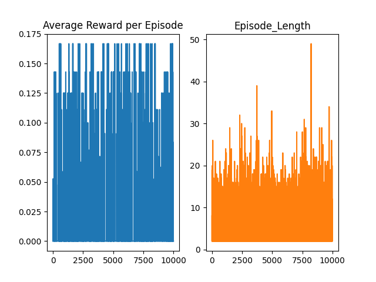

# Using-RL-in-FrozenLake-v0
This repository displays the use of Reinforcement Learning, particularly Q-Learning and Monte Carlo methods to play the FrozenLake-v0 Environment of OpenAI Gym.  
 
 
To better play this environment, there are three reinforcement learning techniques used, and compared:
 
<h3>1. Simple Every Vist Monte Carlo Method</h2>
 No bootstrapping, and updates done at the end of every episode, using a maintained Q-Table.
 The average rewards and episode lengths look like:
 

 
<h3>2. Simple QLearning Method</h2>
 Uses bootstrapping, and updates done at the each timestep of every episode, using a maintained Q-Table.
 The average rewards and episode lengths look like:
 

 
<h3>3. Deep QLearning Method</h2>
 Uses bootstrapping, and updates done at the each timestep of every episode, using a neural network function approximator.
 The average rewards and episode lengths look like:
 

